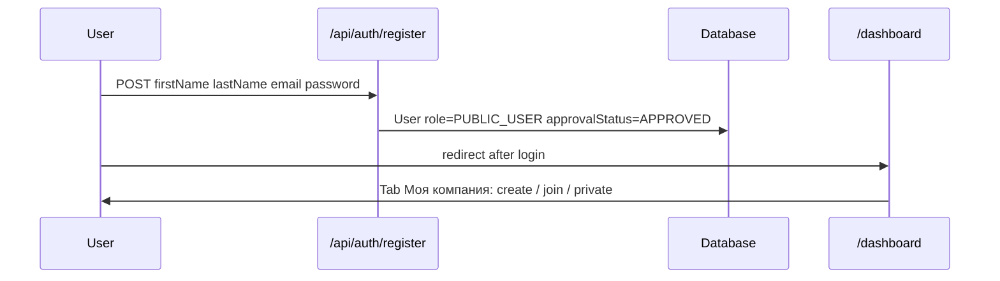
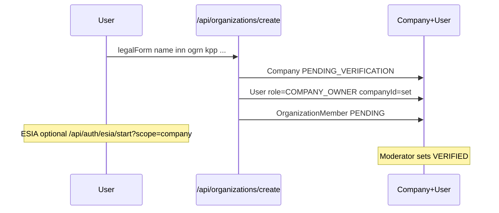
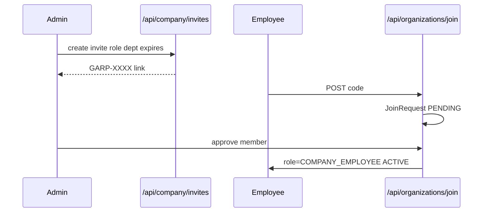
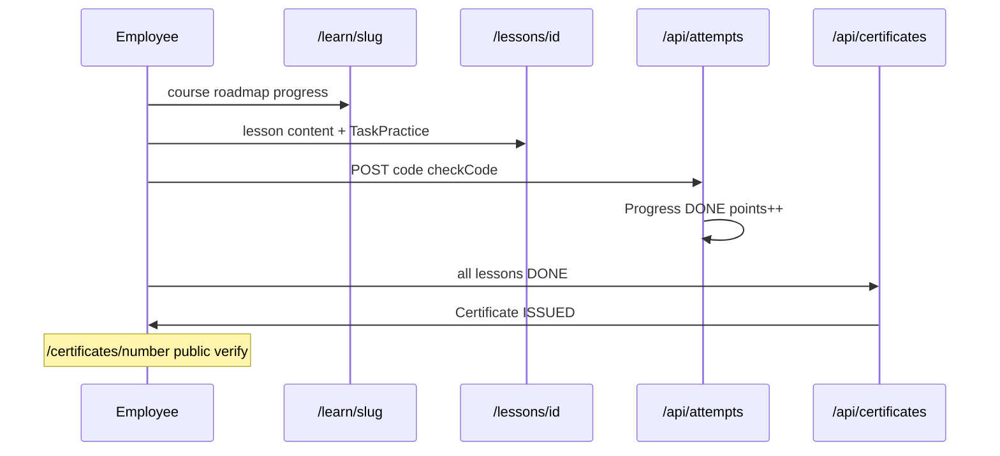
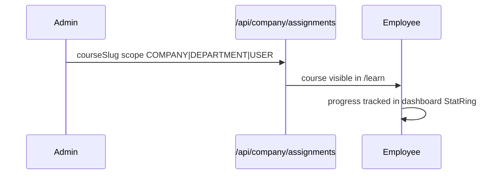
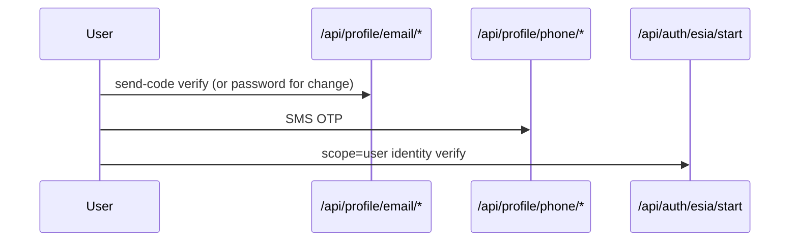
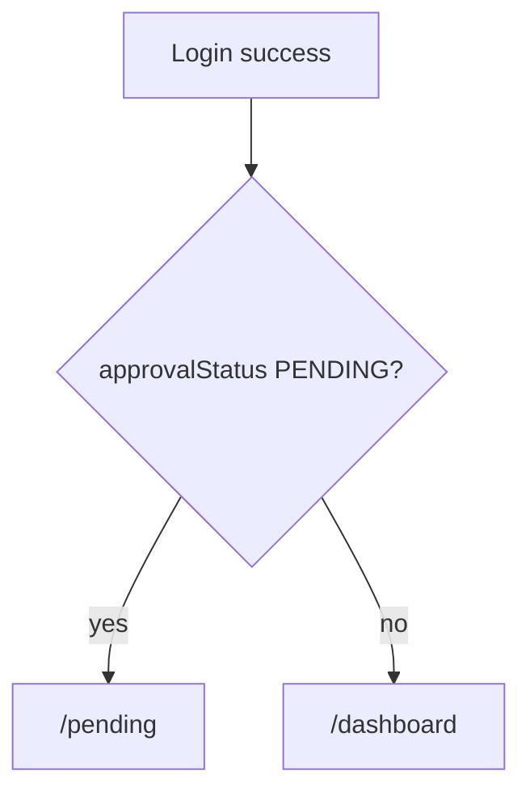
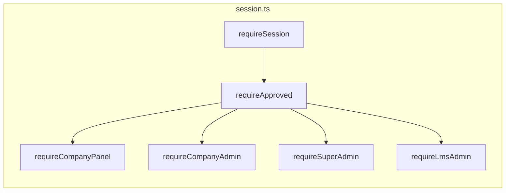

# GARPIUM — User Flows

Full RBAC chains: [docs/GARPIUM-RBAC-ACCESS-MODEL.md](../../docs/GARPIUM-RBAC-ACCESS-MODEL.md)

## Registration → private user

## Company creation

**Files:** `MyCompanySection.tsx`, `organization-legal-forms.ts`, `api/organizations/create/route.ts`

## Invite join (current)

**Files:** `InviteCreateForm.tsx`, `invite/[code]/page.tsx`, join API

## Learning loop

**Files:** `learning.ts`, `TaskPractice.tsx`, `lessons/[lessonId]/page.tsx`

## Course assignment (company)

## Profile verification

**Files:** `PersonalDataTab.tsx`, `api-profile.ts`, ESIA routes

## Post-login routing

**File:** `getPostLoginPath()` in `src/lib/roles.ts`

## Auth guards map

