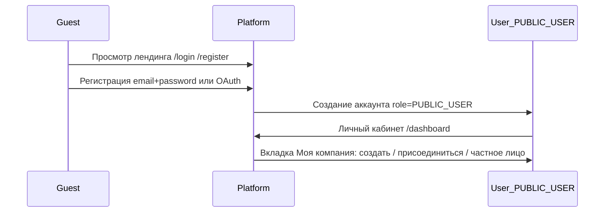
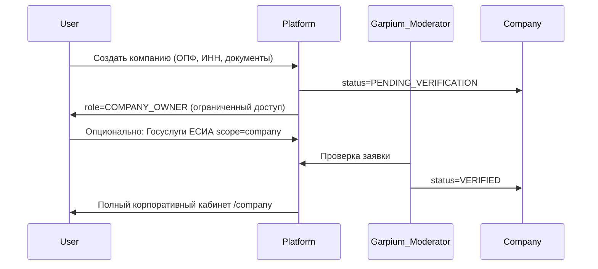
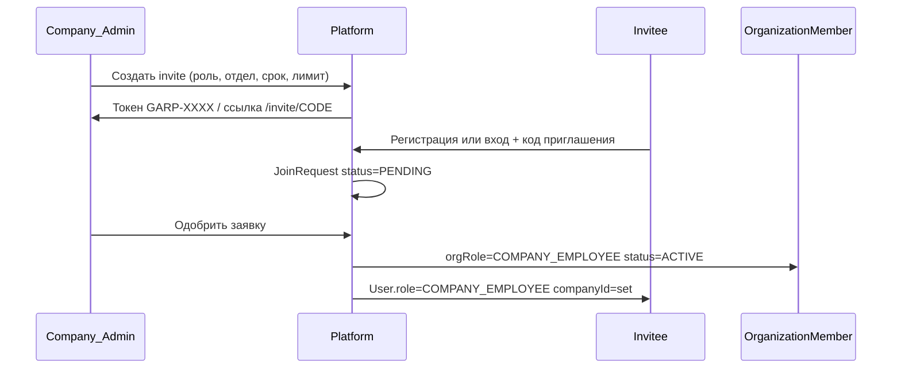
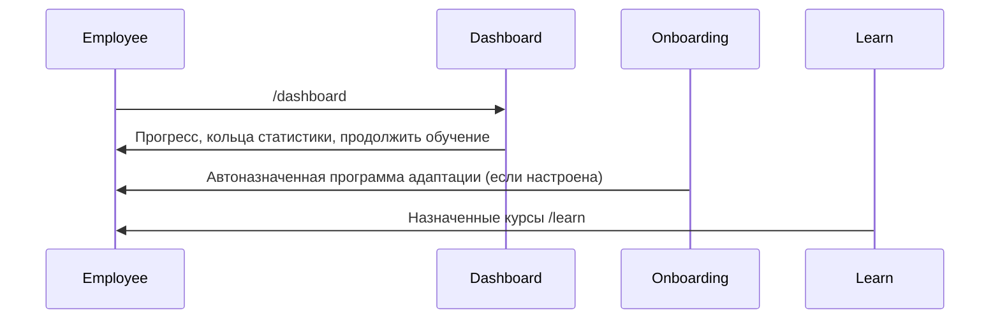
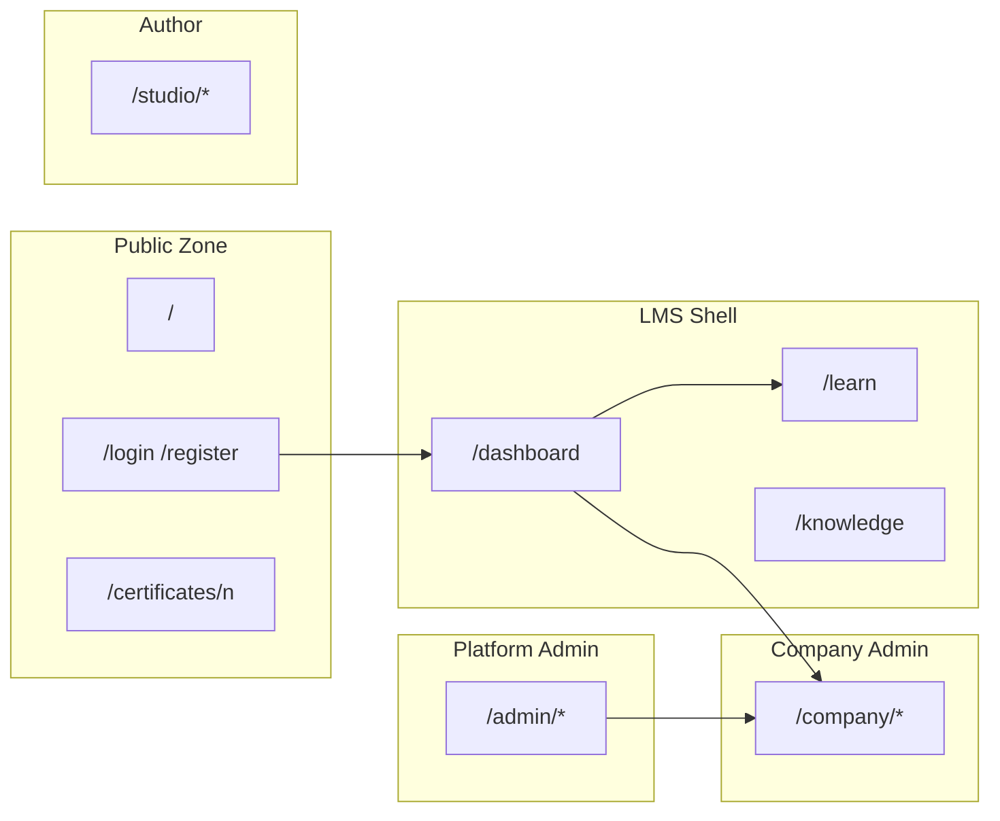

# GARPIUM LMS — Логическая модель пользователей, ролей и прав доступа

> Детализированная схема ролей, интерфейсов, прав и потоков взаимодействия.  
> Продуктовое видение: [GARPIUM-PRODUCT-VISION.md](./GARPIUM-PRODUCT-VISION.md)  
> Связь с кодом: [GARPIUM-IMPLEMENTATION-MAP.md](./GARPIUM-IMPLEMENTATION-MAP.md)

---

## Глоссарий

| RU (UI) | EN (concept) | Prisma `Role` | `OrganizationRole` |
|---------|--------------|---------------|---------------------|
| Гость | Guest | — (не авторизован) | — |
| Частное лицо | — | `PUBLIC_USER` | — |
| Сотрудник | Employee | `COMPANY_EMPLOYEE` | `COMPANY_EMPLOYEE` |
| Руководитель | Manager | `COMPANY_MANAGER` | `COMPANY_MANAGER` |
| Администратор | Company Admin | `COMPANY_ADMIN` | `COMPANY_ADMIN` |
| Владелец | Company Owner | `COMPANY_OWNER` | `COMPANY_OWNER` |
| Автор курсов | Instructor | `INSTRUCTOR` | — |
| Поддержка Garpium | Garpium Support | `SUPPORT` | — |
| Модератор Garpium | Garpium Moderator | `MODERATOR` | — |
| Суперадмин | Super Admin | `SUPER_ADMIN` | — |
| Сотрудник Garpium | — | `GARPIUM_EMPLOYEE` | — |

---

## 1. Архитектура ролей

### 1.1 Tenant-роли (внутри компании)

```
Employee (базовый)
   └── Manager (+ команда, назначения, аналитика отдела)
        └── Company Admin (+ CRUD компании, контент, интеграции)
             └── Company Owner (+ биллинг, лицензии, передача прав)
```

**Принцип наследования:** каждая вышестоящая роль включает возможности нижестоящей + расширения.

### 1.2 Platform-роли (вне tenant)

```
Guest
Support | Moderator | Super Admin
INSTRUCTOR (сквозная — автор контента)
GARPIUM_EMPLOYEE (внутренний tenant Garpium)
```

### 1.3 Две оси роли в коде

| Ось | Где хранится | Назначение |
|-----|--------------|------------|
| `User.role` | Таблица `User` | Глобальная роль платформы + tenant admin flag |
| `OrganizationMember.orgRole` | Членство в компании | Роль внутри конкретной организации |

При разработке RBAC учитывать **обе** оси.

---

## 2. Жизненный цикл: сквозные цепочки

### 2.1 Guest → регистрация



### 2.2 Создание компании → Company Owner



### 2.3 Приглашение → Employee



> **Целевое состояние концепции:** автоматическое вступление после валидного invite.  
> **Текущая реализация:** требуется одобрение администратора (JoinRequest). См. IMPLEMENTATION-MAP.

### 2.4 Первый вход Employee



---

## 3. Детализация по ролям

### 3.1 Guest (неавторизованный)

**Видит:**

- Публичный лендинг `/`
- Тарифы, возможности (маркетинг)
- `/login`, `/register`
- Публичная проверка сертификата `/certificates/[number]`
- Никаких интерфейсов компаний

**Может:**

- Регистрироваться, входить
- Проверять подлинность сертификата
- Отправлять заявку на demo / feedback (целевое)

**Не видит:** LMS shell, dashboard, company panel, admin.

---

### 3.2 PUBLIC_USER (частное лицо)

**Видит:**

- Полный личный кабинет без company sidebar
- Вкладки: Главная · Обучение · Профиль · Моя компания · Настройки
- Публичный каталог курсов (если `courseAccess = all`)
- Sidebar: Мой прогресс, Обучение, База знаний (личная), Помощь

**Может:**

- Проходить доступные курсы
- Управлять профилем (email, phone, password, ESIA)
- Создать компанию или принять invite
- Выбрать «Продолжить как частное лицо»

**Не видит:** `/company/*`, company section в sidebar.

---

### 3.3 Employee (сотрудник)

**Видит — Личный кабинет:**

| Вкладка | Содержимое |
|---------|------------|
| Главная | Прогресс-кольца, продолжить обучение, достижения, активность |
| Обучение | Назначенные курсы, прогресс, сертификаты |
| Профиль | Email, телефон, пароль, Госуслуги |
| Моя компания | Статус организации (read-only) или empty state |
| Настройки | Уведомления, помощь, выход |

**Sidebar (employee):**

- Мой прогресс → `/dashboard`
- Обучение → `/learn`
- База знаний → `/knowledge` (статьи по правам доступа)
- Помощь → `/support`

**Может:**

- Проходить назначенные курсы, уроки, практику
- Получать сертификаты
- Читать Wiki компании (по ACL)
- Выполнять онбординг-чеклисты
- Редактировать свой профиль
- Создавать тикеты поддержки

**Не видит:**

- Данные других сотрудников (кроме публичных полей)
- Аналитику компании / отдела
- `/company/*` admin panel
- Настройки компании, приглашения, интеграции

---

### 3.4 Manager (руководитель отдела)

**Наследует:** всё от Employee.

**Дополнительно видит (целевое состояние):**

- **Моя команда** — сотрудники своего отдела
- **Аналитика отдела** — прогресс, лидеры, отстающие
- **Назначение обучения** — только подчинённым своего отдела
- **Онбординг отдела** — прогресс новых сотрудников

**Может:**

- Назначать готовые курсы на свой отдел
- Просматривать статистику отдела
- Проверять задания с открытым ответом (если настроено)
- Оценивать адаптацию

**Не может (по концепции):**

- Удалять сотрудников, менять структуру отделов
- Создавать курсы и Wiki (это Admin; Instructor — отдельная роль)
- Биллинг, интеграции, глобальные настройки

> **Текущая реализация:** `COMPANY_MANAGER` входит в `COMPANY_ADMIN_ROLES` и видит полный `/company/*`. Это расхождение — см. IMPLEMENTATION-MAP.

---

### 3.5 Company Admin (администратор компании)

**Видит — Company Dashboard `/company/*`:**

| Модуль | Маршрут |
|--------|---------|
| Обзор | `/company` |
| Сотрудники | `/company/employees` |
| Отделы | `/company/departments` |
| Курсы | `/company/courses` |
| Программы | `/company/programs` |
| База знаний | `/company/knowledge` |
| Onboarding | `/company/onboarding` |
| Приглашения | `/company/invitations` |
| Аналитика | `/company/analytics` |
| Интеграции | `/company/integrations` |
| Настройки | `/company/settings` |
| Audit | `/company/settings/audit` |

**+ Sidebar:** секция «Компания» (все пункты выше)

**Может:**

- CRUD сотрудников, отделов, приглашений
- Создавать и назначать курсы (целевое: конструктор)
- Управлять Wiki, онбордингом, сертификатами
- Назначать роли: Employee, Manager, Admin (не Owner)
- API keys, интеграции, домены
- Просмотр аналитики всей компании, экспорт
- Audit log компании

**Не может:**

- Биллинг, смена тарифа (Owner)
- Удаление компании
- Назначить Super Admin / Moderator

---

### 3.6 Company Owner (владелец)

**Наследует:** всё от Company Admin.

**Дополнительно (целевое):**

| Модуль | Функции |
|--------|---------|
| Подписка и оплата | Тариф, лицензии, счета |
| Верификация | Документы, повторная подача, ESIA |
| Передача прав | Назначить другого Owner |
| Удаление компании | Через поддержку |

**Может:** безоговорочный доступ ко всем данным компании + финансы.

---

### 3.7 INSTRUCTOR (автор курсов)

**Видит:**

- Sidebar секция «Автор»: `/studio`, `/marketplace`
- Studio dashboard, список курсов, редактор блоков

**Может:**

- Создавать и редактировать свои курсы
- Публиковать на маркетплейс (с модерацией)
- Просматривать статистику своих курсов

**Не видит:** company admin (если не совмещает роли), platform admin.

---

### 3.8 SUPPORT (Garpium Support)

**Видит (целевое):**

- Панель поддержки: очередь тикетов всех компаний
- Минимальный контекст: компания, тариф, email пользователя

**Может:**

- Отвечать на тикеты, менять статус
- Эскалировать на Super Admin

**Не может:** редактировать данные компании, назначать курсы, менять роли.

> **Текущая реализация:** роль в enum, dedicated panel — частично (`/support` для пользователей).

---

### 3.9 MODERATOR (Garpium Moderator)

**Видит:**

- `/admin/moderation` — очередь модерации
- `/admin/platform/organizations` — верификация компаний

**Может:**

- Подтвердить / отклонить верификацию компании
- Запросить доп. документы
- Модерировать контент маркетплейса

**Не может:** доступ к обучению и сотрудникам внутри компаний (только профиль верификации).

---

### 3.10 SUPER_ADMIN

**Видит:**

- `/admin` — LMS admin
- `/admin/platform/organizations` — все организации
- `/admin/moderation`, `/admin/marketplace`
- `/admin/content`, `/admin/api`

**Может:**

- Управление всеми компаниями и пользователями
- Блокировка, смена тарифа, глобальные настройки
- Impersonation (целевое)
- Все тикеты, финансовый обзор (целевое)

---

## 4. Логика модулей по ролям

### 4.1 Обучение

| Действие | Employee | Manager | Admin | Owner | Instructor |
|----------|----------|---------|-------|-------|------------|
| Проходить курс | ✅ | ✅ | ✅ | ✅ | ✅ |
| Назначить курс (отдел) | | ✅* | ✅ | ✅ | |
| Назначить курс (вся компания) | | | ✅ | ✅ | |
| Создать курс | | | ✅ | ✅ | ✅ |
| Проверить задание | | ✅* | ✅ | ✅ | ✅ |
| Выдать сертификат | auto | auto | auto | auto | auto |

\*Целевое — только свой отдел.

**Поток прохождения:**

1. Admin создаёт курс в Studio / конструкторе
2. Admin/Manager назначает → уведомление Employee
3. Employee проходит уроки → тесты → практика
4. 100% обязательных блоков → сертификат с QR

### 4.2 Onboarding

| Действие | Employee | Manager | Admin |
|----------|----------|---------|-------|
| Проходить программу | ✅ | ✅ | ✅ |
| Мониторить отдел | | ✅ | ✅ |
| Создать шаблон | | | ✅ |
| Привязать к должности/отделу | | | ✅ |

### 4.3 База знаний

| Действие | Employee | Manager | Admin |
|----------|----------|---------|-------|
| Читать (по ACL) | ✅ | ✅ | ✅ |
| Создать/редактировать | | | ✅ |
| Настроить видимость | | | ✅ |

### 4.4 Аналитика

| Уровень | Роли |
|---------|------|
| Личная | Employee, все |
| Отдел | Manager |
| Компания | Admin, Owner |
| Платформа | Super Admin (обезличенно) |

---

## 5. UI-скелеты по ролям

### 5.1 Employee Dashboard

```
+-----------------------------------------------+
| [Sidebar: имя пользователя]                    |
| Мой прогресс | Обучение | БЗ | Помощь         |
+-----------------------------------------------+
| [Имя Фамилия]  [вкладки LK]                   |
+-----------------------------------------------+
| Продолжить обучение → [курс] [====] 68%        |
| (○)(○)(○)(○)  кольца: уроки, курсы, уровень   |
| Достижения          | Активность              |
+-----------------------------------------------+
```

### 5.2 Manager (целевой)

```
+-----------------------------------------------+
| + Моя команда: отдел Продажи                   |
| Сотрудники: [Иванов 90%] [Петрова 45%]        |
| Успеваемость отдела: 72%                       |
| [Назначить курс] [Отчёт] [Онбординг: 1 новый] |
+-----------------------------------------------+
```

### 5.3 Company Admin

```
+-----------------------------------------------+
| Company: ООО Ромашка                           |
| Обзор | Сотрудники | Отделы | Курсы | ...     |
+-----------------------------------------------+
| Сотрудников: 56 | Курсов: 12 | Завершено: 234  |
| [Создать курс] [Приглашение] [+ Сотрудник]    |
+-----------------------------------------------+
```

### 5.4 Company Owner

Как Admin + пункт **«Подписка и оплата»** + виджет тарифа/лицензий.

### 5.5 Guest

```
+-----------------------------------------------+
| GARPIUM — корпоративное обучение               |
| [О продукте] [Тарифы] [Документация] [Войти]  |
+-----------------------------------------------+
| Hero + секции возможностей + footer            |
+-----------------------------------------------+
```

---

## 6. Матрица прав (ключевые действия)

| Действие | Guest | Employee | Manager | Co.Admin | Owner | Support | Moderator | Super |
|----------|:-----:|:--------:|:-------:|:--------:|:-----:|:-------:|:---------:|:-----:|
| Публичные страницы | ✅ | ✅ | ✅ | ✅ | ✅ | ✅ | ✅ | ✅ |
| Регистрация / вход | ✅ | ✅ | ✅ | ✅ | ✅ | ✅ | ✅ | ✅ |
| Свой ЛК | | ✅ | ✅ | ✅ | ✅ | | | ✅* |
| Прохождение курсов | | ✅ | ✅ | ✅ | ✅ | | | |
| Свои сертификаты | | ✅ | ✅ | ✅ | ✅ | | | |
| Wiki компании | | ✅† | ✅† | ✅ | ✅ | | | ✅* |
| Свой отдел | | | ✅ | ✅ | ✅ | | | ✅* |
| Назначить курс (отдел) | | | ✅ | ✅ | ✅ | | | ✅* |
| Назначить курс (все) | | | | ✅ | ✅ | | | ✅* |
| Аналитика отдела | | | ✅ | ✅ | ✅ | | | ✅* |
| Аналитика компании | | | | ✅ | ✅ | | | ✅* |
| Структура компании | | | | ✅ | ✅ | | | ✅* |
| Создание курсов | | | | ✅ | ✅ | | | |
| Онбординг (управление) | | | | ✅ | ✅ | | | |
| API / интеграции | | | | ✅ | ✅ | | | ✅ |
| Подписка / биллинг | | | | | ✅ | | | ✅ |
| Приглашения | | | | ✅ | ✅ | | | |
| Верификация компании | | | | загрузка | загрузка | | ✅ | ✅ |
| Тикеты поддержки | | создать | создать | создать | создать | ответ | | ✅ |
| Панель суперадмина | | | | | | | | ✅ |

† По ACL. \* Через impersonation или admin panel.

---

## 7. UI-зоны платформы



---

## 8. Заключение

Модель построена на:

1. **Multi-tenant изоляции** — все запросы фильтруются по `companyId`
2. **Иерархии tenant-ролей** — Employee → Owner
3. **Разделении platform vs tenant admin**
4. **Едином входе** — UI определяется ролью после auth

Используйте эту схему для: RLS в БД, frontend routing, guards (`requireCompanyAdmin`), user stories в ТЗ.

---

## Связанные документы

- [GARPIUM-PRODUCT-VISION.md](./GARPIUM-PRODUCT-VISION.md)
- [GARPIUM-IMPLEMENTATION-MAP.md](./GARPIUM-IMPLEMENTATION-MAP.md)
- `.cursor/skills/garpium-platform/SKILL.md` — краткая версия для агента
